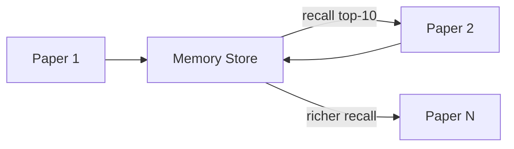
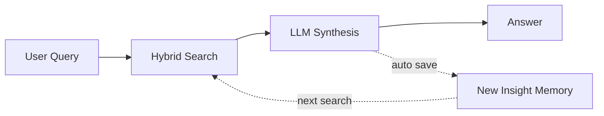
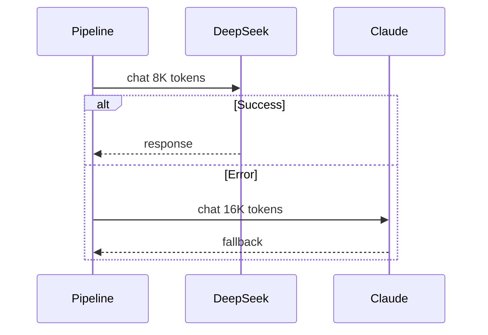
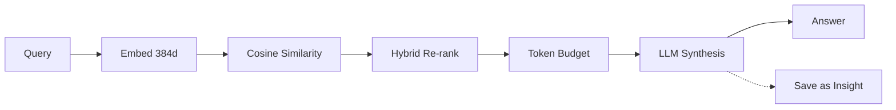

# ReadLoop — 系统架构与设计文档

> 一个基于 Harness Engineering 理念设计的多论文研究 Agent 系统
>
> **文档定位**: 解释 ReadLoop 的设计理念、系统架构、核心机制与演示路径

---

## 1. 项目定位与设计哲学

### 1.1 什么是 ReadLoop

ReadLoop 是一个面向**多论文协同阅读与分析**的 Agent Harness 系统。它的核心价值不在于让 AI 更好地分析单篇论文——这件事直接用 ChatGPT 就能做到——而在于**串联多篇同类型论文**，自动发现它们之间的共享概念、方法对比、互补关系和研究空白。

单篇论文分析是手段，**跨论文知识网络**才是目的。

**ReadLoop vs 直接让 AI 读论文：**

```
直接问 ChatGPT:
    论文A → LLM → 分析A → 丢弃
    论文B → LLM → 分析B → 丢弃（不知道A说了什么）
    论文C → LLM → 分析C → 丢弃（不知道A和B说了什么）

ReadLoop:
    论文A → LLM → 分析A → 知识图谱 + 记忆库
    论文B → [召回A的知识] → LLM → 分析B(含A的对比) → 更新图谱 + 记忆
    论文C → [召回A+B的知识] → LLM → 分析C(含A+B的对比) → 更新图谱 + 记忆
                                                          ↓
                                            发现: A和C共享概念X，但B用了不同方法
                                            发现: 方法M从未在数据集D上被评估
                                            发现: 3篇论文形成一个研究主题簇
```

**这基于 Harness Engineering（驾驭工程）的三个核心原则：**

| 原则 | 含义 | 在 ReadLoop 中的体现 |
|------|------|---------------------|
| **知识不丢弃** | LLM 的每一次输出都被结构化提取并持久化 | analysis.md → extraction.json → graph.json + memory_store.json |
| **知识可计算** | 提取的知识不是死文本，而是可查询、可推理的结构化数据 | 390 节点知识图谱 + 250 条可语义搜索的记忆条目 + Leiden 社区检测 |
| **知识会增长** | 系统越用越智能——新论文的分析受益于已有知识 | 上下文召回 + Q&A 反馈循环：每次问答自动沉淀为新记忆 |

### 1.2 设计理念：从“读论文工具”到“研究操作系统”

ReadLoop 的设计出发点不是“再做一个论文摘要器”，而是回答一个更根本的问题：

> 当我们连续阅读几十篇、几百篇同一领域论文时，如何让每一次阅读都沉淀为后续研究可以复用的资产？

传统 AI 论文阅读通常停留在“单轮问答”层面：用户上传一篇论文，模型输出摘要，摘要被人看完后就散落在对话历史里。这样的流程有三个问题：

1. **知识无法累积**：第 10 篇论文的分析并不会自然继承前 9 篇的发现。
2. **关系无法计算**：论文之间的共享概念、方法改进、评测差异和潜在冲突只能靠人工记忆。
3. **研究闭环无法形成**：摘要、问答、综述、提案和可视化彼此割裂，无法共同构成持续增长的研究资产。

ReadLoop 因此采用“Harness 优先”的设计思想：LLM 不是唯一主体，而是被放入一个可控、可持久化、可验证的工程框架中。模型负责阅读、抽取、综合与生成；Harness 负责组织上下文、保存中间产物、建立图谱、构建记忆、执行检索、控制导出，并把每一步都变成可复用资产。

#### 1.2.1 以论文为输入，以知识资产为输出

ReadLoop 不把 `analysis.md` 当作终点，而把它视为后续计算的中间资产。每篇论文经过处理后，会继续派生出：

- `extraction.json`：论文中的结构化实体与关系。
- `digest.json`：用于跨论文综合的紧凑摘要。
- `graph.json`：跨论文知识图谱。
- `memory_store.json`：可语义搜索的长期记忆。
- `cross_analysis.md`：基于多篇论文的综合判断。
- `wiki / graphml / html`：可外部浏览、编辑和分析的导出结果。

这意味着系统真正追求的不是“这篇论文讲了什么”，而是“这篇论文如何进入整个研究知识网络”。

#### 1.2.2 图谱与记忆双轨建模

ReadLoop 同时维护两套互补的知识结构：

| 轨道 | 解决的问题 | 典型能力 |
|------|------------|----------|
| **知识图谱** | 论文、概念、方法、数据集、指标之间是什么关系 | 社区检测、God Nodes、惊奇连接、GraphML、HTML 可视化 |
| **长期记忆** | 如何从大量论文知识中快速召回相关事实和主张 | `/ask` 问答、上下文召回、综述生成、主题检索 |

图谱更适合回答“结构性问题”：哪些概念连接最多？哪些论文共享方法？哪些主题形成了社区？  
记忆更适合回答“语义性问题”：A-MEM 和 Mem0 有什么区别？哪些论文讨论记忆压缩？某个方向的代表性结论是什么？

双轨设计让 ReadLoop 同时具备“结构理解”和“语义问答”能力。

#### 1.2.3 把 LLM 输出变成可验证的中间过程

ReadLoop 的重要取舍是：尽量不让 LLM 的一次输出直接成为最终事实。系统会把 LLM 输出拆成多个可检查阶段：

1. 单篇论文先生成 `analysis.md`。
2. 再从分析中抽取结构化 `extraction.json`。
3. 跨论文分析先生成候选 insight。
4. 再进行 evidence grounding 验证。
5. 最后只基于验证后的 insight 生成综合报告。

这种做法降低了“模型一次性自由发挥”的风险，让研究结论更容易追踪来源，也更适合演示和复核。

#### 1.2.4 系统越用越有上下文

ReadLoop 的增长性体现在两条路径：

- **论文增长**：新增论文后，重新 `/build` 和 `/build-mem`，图谱和记忆会纳入新知识。
- **交互增长**：用户通过 `/ask` 得到的高价值问答，也可以作为低置信度 insight 写回记忆库，成为后续检索的辅助线索。

这让系统逐渐从“处理文档的工具”变成“积累研究上下文的环境”。

#### 1.2.5 本地优先、可重建、可演示

ReadLoop 采用本地文件作为主要存储方式，不依赖外部数据库。这样做有三个原因：

1. **可控**：论文、分析、图谱、记忆和导出文件都在本地目录中。
2. **可重建**：大部分衍生资产都可以从 `analysis.md` 重新构建。
3. **可演示**：每一步都有明确产物，适合录屏、汇报和教学。

因此，ReadLoop 的工程哲学不是追求一个黑盒式 Agent，而是追求一个每个阶段都能解释、能复用、能导出的研究流水线。

#### 1.2.6 研究闭环：阅读、连接、提问、输出

ReadLoop 最终形成的是一个完整研究闭环：

```
论文输入
  ↓
单篇分析
  ↓
图谱构建 + 记忆构建
  ↓
社区发现 + 语义问答
  ↓
跨论文分析 + 文献综述 + 概念演化
  ↓
研究问题 + 研究提案 + 可视化导出
```

这个闭环体现了 ReadLoop 的核心定位：它不是替代研究者，而是帮助研究者把重复性阅读、整理、关联和初步综合工作系统化，让人把更多精力放在判断、选择和创新上。

### 1.3 ReadLoop 的 Harness 架构

```
┌──────────────────────────────────────────────────────────────────────────┐
│                       ReadLoop Agent Harness                             │
│                                                                          │
│  ┌──────────┐   ┌──────────────┐   ┌─────────────────────────────────┐  │
│  │  摄入层   │──▶│   分析层      │──▶│          知识层                  │  │
│  │ (Reader)  │   │  (Pipeline)  │   │  (Graph + Memory + Clustering)  │  │
│  └──────────┘   └──────┬───────┘   └────────────┬────────────────────┘  │
│                        │                         │                       │
│                        │    ┌─────────────────────┘                      │
│                        │    │  上下文召回 + Q&A 反馈                       │
│                        │    ▼                                            │
│                 ┌──────┴───────┐   ┌──────────────────────────────────┐  │
│                 │   增强分析    │   │           应用层                  │  │
│                 │ (Enriched)   │   │  Review / Gaps / Proposals /     │  │
│                 └──────────────┘   │  Gods / Surprises / Questions    │  │
│                                    └──────────────────────────────────┘  │
│                                                                          │
│  ┌───────────────────────────────────────────────────────────────────┐   │
│  │                      交互式 CLI (REPL)                             │   │
│  │  24 个 slash 命令 | Tab 补全 | 输入历史 | Rich 输出                  │   │
│  └───────────────────────────────────────────────────────────────────┘   │
└──────────────────────────────────────────────────────────────────────────┘
```

---

## 2. 系统架构总览

### 2.1 分层架构

```
┌─────────────────────────────────────────────────────────────────────────────┐
│  Layer 1: 摄入层 (Ingest)                                                   │
│  PDF / 图片目录 ──▶ PyMuPDF 文本提取 ──▶ 智能截断 (保留首尾)                  │
└────────────────────────────────────┬────────────────────────────────────────┘
                                     ▼
┌─────────────────────────────────────────────────────────────────────────────┐
│  Layer 2: 分析层 (Analysis)                                                  │
│  [记忆召回: 注入前N-1篇知识] ──▶ LLM 深度分析 ──▶ analysis.md (11节/370行)    │
└────────────────────────────────────┬────────────────────────────────────────┘
                                     ▼
┌─────────────────────────────────────────────────────────────────────────────┐
│  Layer 3: 提取层 (Extraction)                                                │
│  analysis.md ──▶ LLM 结构化提取 ──▶ extraction.json (概念/方法/关系)          │
└────────────────────────────────────┬────────────────────────────────────────┘
                                     ▼
┌─────────────────────────────────────────────────────────────────────────────┐
│  Layer 4: 知识层 (Knowledge)                                                 │
│  ┌─────────────────────────┐    ┌──────────────────────────────────┐        │
│  │ 知识图谱 (390n, 467e)    │    │ 记忆库 (250 entries + embeddings) │        │
│  │  + 跨论文边检测           │    │  + 上下文召回 (反馈到分析层)      │        │
│  │  + Leiden 社区检测        │    │  + Q&A 反馈循环                  │        │
│  └─────────────────────────┘    └──────────────────────────────────┘        │
└────────────────────────────────────┬────────────────────────────────────────┘
                                     ▼
┌─────────────────────────────────────────────────────────────────────────────┐
│  Layer 5: 图谱分析层 (Graph Analysis)                                        │
│  God Nodes (核心节点) | Surprising Connections (跨社区) | Research Questions  │
└────────────────────────────────────┬────────────────────────────────────────┘
                                     ▼
┌─────────────────────────────────────────────────────────────────────────────┐
│  Layer 6: 应用层 (Applications)                                              │
│  研究空白分析 | 研究提案 | 混合语义问答 | 自动综述 | 概念演进追踪               │
└────────────────────────────────────┬────────────────────────────────────────┘
                                     ▼
┌─────────────────────────────────────────────────────────────────────────────┐
│  Layer 7: 导出层 (Export)                                                    │
│  交互式 HTML (sidebar) | Obsidian Wiki (174篇) | GraphML (Gephi) | Mermaid  │
└─────────────────────────────────────────────────────────────────────────────┘
```

### 2.2 数据流全景

```
PDF ──▶ PyMuPDF ──▶ [记忆召回] ──▶ LLM 分析 ──▶ analysis.md
                                                      │
                                          ┌───────────┘
                                          ▼
                                    LLM JSON 提取 ──▶ extraction.json
                                                           │
                              ┌────────────────────────────┼────────────────┐
                              ▼                            ▼                │
                        graph.json                  memory_store.json       │
                        (知识图谱)                   (记忆条目)              │
                              │                            │                │
                    ┌─────────┼─────────┐                  ▼                │
                    ▼         ▼         ▼           embeddings.npy          │
              跨论文边    Leiden     God Nodes        (384维向量)             │
               检测      社区检测    分析                   │                │
                    │         │         │                  ▼                │
                    ▼         ▼         ▼            语义问答 (/ask)        │
              shared_    研究主题    惊奇连接              │                │
              concept    聚类       研究问题              ▼                │
                                                   Q&A 反馈循环 ──────────┘
                                                   (自动存为新记忆)
```

---

## 3. 项目结构

```
D:/wu/readloop/
├── run.py                           # CLI 总入口: argparse + 交互模式 (513 行)
├── requirements.txt                 # 依赖声明
├── .env                             # API 密钥 (gitignore)
│
└── src/
    ├── cli.py                       # 交互式 REPL: 24 个 slash 命令 (725 行)
    ├── config.py                    # 集中配置: API keys, 路径, 模型参数 (36 行)
    ├── client.py                    # LLM 客户端: DeepSeek 主力 + Claude 备选 (100 行)
    ├── pipeline.py                  # 核心管道: 分析 + 后处理提取 (170 行)
    ├── reader.py                    # PDF/图片文本提取 (79 行)
    ├── prompts.py                   # 分析 Prompt 模板 (380 行)
    │
    ├── knowledge/                   # ── Harness 核心: 知识图谱 ──
    │   ├── models.py                # Node, Edge, KnowledgeGraph 数据模型 (134 行)
    │   ├── extractor.py             # analysis.md → 结构化 JSON (130 行)
    │   ├── graph.py                 # 图谱构建 + 跨论文边检测 + 空白发现 (154 行)
    │   ├── nx_bridge.py             # KnowledgeGraph ↔ NetworkX 桥接层 (54 行)
    │   ├── cluster.py               # Leiden 社区检测 + 社区命名 (189 行)
    │   ├── analyze.py               # God nodes + 惊奇连接 + 研究问题 (208 行)
    │   ├── html_viz.py              # 交互式 HTML: sidebar + 社区着色 (400 行)
    │   ├── visualize.py             # Mermaid Markdown 概览 (101 行)
    │   ├── wiki_export.py           # Obsidian Wiki 导出 (231 行)
    │   ├── graphml_export.py        # GraphML 导出 (26 行)
    │   └── prompts.py               # 提取 & 空白分析 Prompt (93 行)
    │
    ├── memory/                      # ── Harness 核心: 长期记忆 ──
    │   ├── models.py                # MemoryEntry, MemoryStore (91 行)
    │   ├── store.py                 # 记忆提取 + 持久化 (99 行)
    │   ├── embeddings.py            # 本地 Embedding: all-MiniLM-L6-v2 (110 行)
    │   ├── search.py                # 混合评分搜索 + Q&A 反馈循环 (170 行)
    │   ├── recall.py                # 上下文召回 (增强新论文分析) (49 行)
    │   └── prompts.py               # 记忆提取 & 问答 Prompt (52 行)
    │
    └── features/                    # ── 高价值衍生功能 ──
        ├── review.py                # 自动综述生成 (110 行)
        ├── evolution.py             # 概念演进追踪 (97 行)
        └── proposals.py             # 研究提案生成 (100 行)
```

---

## 4. 核心模块详解

### 4.1 知识图谱数据模型 (`knowledge/models.py`)

```
KnowledgeGraph
├── nodes: dict[str, Node]               # 390 个节点
│   └── Node
│       ├── id: str                       # "paper:a-mem", "concept:zettelkasten"
│       ├── type: str                     # paper | concept | method | dataset | metric
│       ├── label: str                    # 人类可读名称
│       ├── metadata: dict                # 类型相关元数据
│       └── community: int | None         # Leiden 社区 ID
│
├── edges: list[Edge]                     # 467 条边
│   └── Edge
│       ├── source / target: str          # 节点 ID
│       ├── relation: str                 # proposes | uses | improves | compares |
│       │                                 # contradicts | complements | shared_concept
│       ├── weight: float                 # 置信度 0-1
│       └── evidence: str                 # 证据摘要
│
├── community_labels: dict[int, str]      # {0: "Conflict Resolution Research"}
├── community_cohesion: dict[int, float]  # {0: 0.08}
└── version: int
```

**当前规模**: 390 nodes (14 paper + 162 concept + 116 method + 43 dataset + 55 metric), 467 edges, 120 communities (12 major + 108 isolates)

### 4.2 记忆系统数据模型 (`memory/models.py`)

```
MemoryStore
└── entries: dict[str, MemoryEntry]       # 250+ 条记忆
    └── MemoryEntry
        ├── id: str                       # SHA-256 hash (前 16 hex)
        ├── type: str                     # fact | claim | insight
        ├── content: str                  # 知识陈述
        ├── source_papers: list[str]      # 来源论文
        ├── domain_tags: list[str]        # 领域标签
        ├── confidence: float             # 0-1
        └── created_at: str               # ISO 时间戳

EmbeddingIndex
├── ids: list[str]                        # 条目 ID 列表
└── vectors: ndarray (N, 384)             # all-MiniLM-L6-v2 向量
```

**三种记忆类型的设计意图**:

| 类型              | 来源                 | 示例                             | 置信度 |
| ----------------- | -------------------- | -------------------------------- | ------ |
| **Fact**    | LLM 从论文提取       | "Mem0 使用 neo4j 图数据库"       | 1.0    |
| **Claim**   | LLM 从论文提取       | "A-MEM 比 MemGPT 节省 78% token" | 0.8    |
| **Insight** | Q&A 反馈循环自动生成 | 用户提问的合成答案               | 0.7    |

### 4.3 Bridge Pattern (`knowledge/nx_bridge.py`)

ReadLoop 使用自定义 `KnowledgeGraph` dataclass 作为主数据结构，但社区检测和图分析算法需要 NetworkX。Bridge Pattern 实现双向转换：

```
KnowledgeGraph (ReadLoop 自有)
    │
    ├── to_networkx(graph) ──────▶ nx.Graph (undirected)
    │                                  │
    │                                  ├── cluster.py: Leiden 社区检测
    │                                  ├── analyze.py: betweenness centrality
    │                                  └── graphml_export.py: nx.write_graphml
    │                                  │
    └── annotate_communities() ◀───── 结果回写到 Node.community
```

**设计决策：**

- 使用无向图（Leiden/Louvain 要求）
- 平行边取最高 weight（论文间可能同时 `uses` 和 `improves` 同一方法）
- 仅保留标量 metadata 避免序列化问题

---

## 5. Harness Engineering 核心机制

### 5.1 机制一: 双阶段提取 (Two-Stage Extraction)

```
阶段 1: 深度分析 (面向人类阅读)
    PDF → [记忆召回] → LLM → analysis.md (370行, 11节结构化 Markdown)

阶段 2: 结构化提取 (面向机器处理)
    analysis.md → LLM → extraction.json (概念/方法/关系 JSON)
```

**为什么不一步到位？** 两个阶段目标冲突：

- 分析阶段追求表达丰富、对比深入、有创见
- 提取阶段追求结构统一、可匹配、无歧义

分开后提取阶段输入是已结构化的 analysis.md（而非原始 PDF），准确率显著更高。

### 5.2 机制二: 知识回流 (Knowledge Feedback Loop)

ReadLoop 有**两层**反馈循环：

**循环 1: 上下文召回（论文分析时）**



实现：`memory/recall.py` 取新论文前 2000 字符作为 preview，用 embedding 检索语义最相关的 top-10 记忆条目（过滤 < 0.2 的噪声），注入分析 prompt。

**循环 2: Q&A 反馈（用户问答时）**



实现：`memory/search.py` 的 `_save_qa_as_memory()` 每次成功回答后将 Q&A 存为 `insight` 类型记忆（confidence=0.7）。系统越用越聪明。

### 5.3 机制三: 跨论文边自动检测

```python
def detect_cross_paper_edges(graph):
    # 1. 建立 {概念ID → 引用该概念的论文集合} 映射
    # 2. 同一概念被 2+ 篇论文引用 → 生成 shared_concept 边
    # 3. 去重避免重复边
```

当前 36 条 `shared_concept` 边连接了 14 篇论文间的共享概念。

### 5.4 机制四: 社区检测与研究主题发现

从 Graphify 适配的 Leiden 算法自动将图谱节点聚类为研究主题簇：

```
算法选择:
    graspologic 可用 → Leiden (最佳质量)
    不可用         → Louvain (networkx 内置，自动降级)

处理流程:
    1. KnowledgeGraph → nx.Graph (via nx_bridge)
    2. 隔离度为 0 的节点 → 各自成一个社区
    3. Leiden 聚类连通节点
    4. 超大社区 (>25% 图谱) → 二次拆分
    5. 按大小降序排列 → 社区 0 = 最大
    6. 启发式命名: 取社区内最高度数 concept 的 label
    7. 计算内聚度: 实际边数 / 最大可能边数
```

**当前结果**: 12 个主要研究主题（如 "Conflict Resolution Research", "Shared Memory Research"）+ 108 个单节点孤立概念。

### 5.5 机制五: 混合搜索评分

v2.1 的搜索不再只用 embedding 相似度，而是融合四个信号：

```
hybrid_score = embedding_similarity × 0.70   # 语义相关性
             + keyword_match_rate   × 0.15   # 关键词精确匹配
             + domain_tag_match     × 0.10   # 领域标签匹配
             + confidence_boost     × 0.05   # 高置信度条目优先
```

流程：先用 embedding 取 top_k×2 候选 → 混合评分重排序 → 取 top_k → 按 token budget (6000 tokens) 截断 → 发送给 LLM 合成答案。

### 5.6 机制六: 增量更新

| 操作       | 增量行为                              |
| ---------- | ------------------------------------- |
| 分析新论文 | 跳过已有 analysis.md 的论文           |
| 构建图谱   | 跳过已有 extraction.json 的论文       |
| 添加单篇   | `add_paper_to_graph()` 只处理新论文 |
| 记忆库     | 基于 paper_name 去重                  |
| Q&A 缓存   | 相同查询的 SHA-256 hash 去重          |

---

## 6. 图谱分析系统

### 6.1 God Nodes

找图谱中连接最多的核心节点：

```python
god_nodes(graph, top_n=10) -> list[dict]
# 返回: [{id, label, type, edges, community}]
# 当前 Top-3: Memory in Multi-agent Systems (29),
#             Intrinsic Memory Agents (26), Memory as Action (26)
```

### 6.2 Surprising Connections

发现跨社区的惊奇连接，揭示非显而易见的研究关联：

```
评分系统:
    跨社区基础分          +3
    contradicts 关系      +4  (矛盾发现最有价值)
    compares 关系          +2
    低权重 (<0.5)          +1  (不确定的连接更值得关注)
    外围节点→枢纽节点      +1  (意外的远距离连接)
```

### 6.3 Research Questions

从图谱结构自动生成 5 类研究问题：

| 类型               | 检测方法                  | 示例                                   |
| ------------------ | ------------------------- | -------------------------------------- |
| low_confidence     | 边权重 < 0.5              | "X 和 Y 的关系是否准确？"              |
| bridge_node        | 高 betweenness centrality | "为什么 ReSum 连接了 3 个社区？"       |
| isolated_nodes     | 度数 ≤ 1                 | "Agentic Memory 与其他研究有何联系？"  |
| low_cohesion       | 社区内聚度 < 0.15         | "Conflict Resolution 主题是否应细分？" |
| missing_evaluation | 无 evaluated_on 边        | "方法 X 是否在数据集 Y 上被评估？"     |

---

## 7. 导出与可视化系统

### 7.1 交互式 HTML 可视化

**技术栈**: vis-network 9.1.6 (CDN) + 自定义 sidebar UI

**双重视觉编码**（v2.1 新增）：

- **颜色** = Leiden 社区 ID（10 色调色板循环）
- **形状** = 节点类型（box/ellipse/diamond/database/triangle）
- 无社区数据时自动降级为类型着色

**UI 组件**（从 Graphify export.py 适配）：

| 组件          | 说明                                        |
| ------------- | ------------------------------------------- |
| 搜索框 + 下拉 | 实时搜索 top-20 匹配，点击定位节点          |
| 节点信息面板  | 点击显示详情 + 可点击邻居列表               |
| 社区图例      | 可点击切换社区显隐                          |
| 类型图例      | 可点击切换类型显隐                          |
| 度数缩放      | `size = 10 + 30 × (degree / max_degree)` |
| 置信度边样式  | weight < 0.7 显示虚线                       |
| 统计栏        | 节点数、边数、社区数                        |

**安全**: 所有节点标签和 metadata 经 `html.escape()` 转义后嵌入 tooltip，防止 XSS。

### 7.2 Obsidian Wiki 导出

```
output/wiki/
├── index.md                          # 导航入口：社区列表 + 核心概念排行
├── Conflict Resolution Research.md   # 社区文章：成员论文/概念 + 跨主题连接
├── A-Mem Agentic Memory.md           # 论文文章：元数据 + 所有关联 [[wikilinks]]
├── Zettelkasten Memory.md            # 概念文章：定义 + 相关论文
└── ...                               # 共 174 篇文章
```

所有内部引用使用 `[[wikilinks]]` 格式，可在 Obsidian 中直接打开形成双向链接图谱。

### 7.3 GraphML 导出

通过 nx_bridge 转换为 NetworkX 图后调用 `nx.write_graphml()`，附带 community 和 type 属性。可在 Gephi、yEd、Cytoscape 中打开进行专业图分析。

---

## 8. 交互式 CLI 系统

### 8.1 设计理念

类似 Claude Code 的交互式终端工具，无需 Web 前端，适合录屏演示和日常使用：

```
┌─────────────────────────────────────────────────────┐
│  ReadLoop v2.1.0 -- Agent Harness for Paper Research│
│  Type /help to see commands, /quit to exit          │
└─────────────────────────────────────────────────────┘

ReadLoop> /status
ReadLoop> /gods 5
ReadLoop> /ask 哪些论文讨论了记忆压缩？
ReadLoop> /viz
```

### 8.2 命令全景

| 命令               | 参数                    | 功能                 |
| ------------------ | ----------------------- | -------------------- |
| **论文分析** |                         |                      |
| `/list`          | `[ref\|agent]`         | 列出可用论文         |
| `/analyze`       | `<keyword>`           | 分析单篇论文         |
| `/batch`         | `[ref\|agent] [A\|B\|C]` | 批量分析             |
| `/cross`         |                         | 跨论文综合分析       |
| **知识图谱** |                         |                      |
| `/build`         |                         | 构建图谱（自动聚类） |
| `/graph`         |                         | 图谱统计             |
| `/cluster`       |                         | 运行社区检测         |
| `/viz`           |                         | 浏览器打开交互可视化 |
| `/gods`          | `[n]`                 | Top-N 核心节点       |
| `/surprises`     | `[n]`                 | 跨社区惊奇连接       |
| `/questions`     | `[n]`                 | 生成研究问题         |
| `/gaps`          |                         | 研究空白分析 (LLM)   |
| **记忆搜索** |                         |                      |
| `/memory`        |                         | 记忆统计             |
| `/build-mem`     |                         | 构建记忆库           |
| `/ask`           | `<query>`             | 语义问答 + 反馈循环  |
| **高级功能** |                         |                      |
| `/review`        | `<topic>`             | 自动综述生成         |
| `/track`         | `<concept>`           | 概念演进追踪         |
| `/propose`       | `[topic]`             | 研究提案生成         |
| **导出**     |                         |                      |
| `/wiki`          | `[dir]`               | 导出 Obsidian Wiki   |
| `/graphml`       | `[file]`              | 导出 GraphML         |
| **系统**     |                         |                      |
| `/status`        |                         | 系统状态树           |
| `/help`          |                         | 帮助                 |
| `/clear`         |                         | 清屏                 |
| `/quit`          |                         | 退出                 |

### 8.3 技术实现

| 特性      | 实现                                              |
| --------- | ------------------------------------------------- |
| Tab 补全  | `prompt_toolkit` WordCompleter                  |
| 输入历史  | `~/.readloop_history` (FileHistory)             |
| 模糊匹配  | `/god` → `/gods`，`/sur` → `/surprises` |
| Rich 输出 | Table, Tree, Panel, Markdown 渲染                 |
| 错误隔离  | 命令出错不崩溃 REPL                               |
| Ctrl+C    | 中断当前命令，不退出                              |
| 路径安全  | `/wiki` `/graphml` 输出路径验证，防止路径穿越 |
| 向后兼容  | `python run.py --ask "query"` 脚本模式照常工作  |

---

## 9. LLM 调用架构

### 9.1 双轨容错



### 9.2 LLM 调用点汇总

| 调用点       | 输入             | 输出            | max_tokens | 触发           |
| ------------ | ---------------- | --------------- | ---------- | -------------- |
| 论文深度分析 | PDF 文本         | analysis.md     | 8K/16K     | `/analyze`   |
| 结构化提取   | analysis.md      | extraction.json | 4,000      | 自动           |
| 记忆提取     | analysis.md      | memories JSON   | 4,000      | `/build-mem` |
| 语义问答     | query + memories | answer          | 4,000      | `/ask`       |
| 研究空白     | graph stats      | gaps.md         | 8,000      | `/gaps`      |
| 综述生成     | memories + graph | review.md       | 8,000      | `/review`    |
| 概念演进     | concept mentions | evolution.md    | 4,000      | `/track`     |
| 研究提案     | graph context    | proposals.md    | 8,000      | `/propose`   |

### 9.3 JSON 提取容错链

```
LLM 原始输出 → 直接 json.loads
                → 提取 ```json 代码块
                → 匹配 { ... } 首尾花括号
                → 重试（添加明确 JSON 指令）
```

---

## 10. Embedding 与语义搜索

### 10.1 本地 Embedding 方案

```
模型: all-MiniLM-L6-v2 (sentence-transformers)
大小: 22MB (首次自动下载)
维度: 384
运行: 本地 CPU, 无 API 成本
速度: <50ms/query, ~500条/秒批量
```

### 10.2 混合搜索流程



### 10.3 存储效率

| 论文数量 | 记忆条目  | 向量文件 | 内存占用 |
| -------- | --------- | -------- | -------- |
| 14 篇    | 250 条    | ~400 KB  | ~2 MB    |
| 286 篇   | ~5,000 条 | ~8 MB    | ~20 MB   |

全部 286 篇论文也只需 ~20MB 内存，无外部数据库。

---

## 11. 输出文件结构

```
D:/wu/output/
├── {论文名}/
│   ├── analysis.md              # 深度分析报告 (~370行)
│   └── extraction.json          # 结构化实体 (~30KB)
│
├── 00_cross_analysis/
│   └── cross_analysis.md        # 跨论文综合分析
│
├── knowledge_graph/
│   ├── graph.json               # 完整图谱 (含社区标注)
│   ├── graph.html               # 交互式可视化 (368KB)
│   ├── graph.graphml            # GraphML 导出 (264KB)
│   ├── overview.md              # Mermaid 统计概览
│   ├── gaps.md                  # 研究空白报告
│   ├── analysis.md              # God Nodes + 惊奇连接
│   └── questions.md             # 研究问题
│
├── memory/
│   ├── memory_store.json        # 记忆条目
│   ├── embeddings.npy           # 向量索引
│   └── embedding_ids.json       # ID 映射
│
├── wiki/                        # Obsidian Wiki (174 篇)
│   ├── index.md
│   ├── {社区名}.md
│   └── {节点名}.md
│
├── reviews/{主题}/review.md     # 自动综述
├── evolution/{概念}.md          # 概念演进
└── proposals/proposals.md       # 研究提案
```

---

## 12. 安全设计

| 威胁          | 缓解措施                                                                       |
| ------------- | ------------------------------------------------------------------------------ |
| HTML XSS      | 所有 tooltip 内容经 `html.escape()` 转义                                     |
| 路径穿越      | `/wiki` `/graphml` 输出路径经 `_safe_output_path()` 验证在 OUTPUT_DIR 内 |
| 文件名注入    | `_safe_filename()` 使用 `Path().name` + 正则清理 + strip `..`            |
| API 密钥泄露  | `.env` 文件 + `python-dotenv` + `.gitignore` 排除                        |
| JSON 反序列化 | `Edge.from_dict()` / `Node.from_dict()` 过滤未知 key，兼容旧格式           |
| LLM 输出异常  | `_extract_json()` 四级容错链；`_split_community` 异常 fallback + logging   |

---

## 13. 技术栈

| 层        | 技术                                      | 用途                                            |
| --------- | ----------------------------------------- | ----------------------------------------------- |
| LLM       | DeepSeek V3 (主) + Claude Sonnet 4.6 (备) | 分析、提取、问答、综述                          |
| PDF       | PyMuPDF (fitz)                            | 文本提取                                        |
| Embedding | all-MiniLM-L6-v2 (sentence-transformers)  | 本地语义向量 384 维                             |
| 向量计算  | NumPy                                     | 余弦相似度、top-k                               |
| 图算法    | NetworkX + graspologic (可选)             | Leiden/Louvain 社区检测、betweenness centrality |
| 数据存储  | JSON + NumPy binary                       | 零依赖持久化                                    |
| 可视化    | vis-network 9.1.6 (CDN)                   | 交互式图谱 + sidebar                            |
| CLI       | prompt_toolkit + Rich                     | 交互式 REPL + 终端 UI                           |
| 配置      | python-dotenv                             | 环境变量管理                                    |

**无外部数据库。全部本地文件。**

---

## 14. Graphify 集成说明

v2.1 从 [Graphify](https://github.com/safishamsi/graphify) 代码库 cherry-pick 了 5 项能力，采用 **Bridge Pattern** 适配（不引入 Graphify 作为依赖）：

| 能力            | 来源文件                | 适配方式                         |
| --------------- | ----------------------- | -------------------------------- |
| Leiden 社区检测 | `graphify/cluster.py` | 核心算法照搬，外包 ReadLoop API  |
| 图谱分析        | `graphify/analyze.py` | 去掉 AST 过滤，改为论文领域评分  |
| HTML 可视化     | `graphify/export.py`  | 移植 sidebar + 社区图例 UI 模式  |
| Obsidian Wiki   | `graphify/wiki.py`    | 结构照搬，内容改为论文/概念/方法 |
| GraphML 导出    | `graphify/export.py`  | 简单封装 `nx.write_graphml()`  |

**未迁移**（因 schema 不兼容）：tree-sitter AST 提取、代码文件检测、git hooks、MCP server。

---

## 15. 与"直接让 AI 分析"的本质区别

| 维度                 | 直接问 ChatGPT | ReadLoop Harness                 |
| -------------------- | -------------- | -------------------------------- |
| **知识持久性** | 对话结束就丢失 | 永久存储在图谱 + 记忆中          |
| **跨论文关联** | 做不到         | 自动检测 36 条共享概念边         |
| **累积增强**   | 每次从零开始   | 第 N 篇受益于前 N-1 篇           |
| **Q&A 增长**   | 问完就忘       | 每次问答自动存为新记忆           |
| **批量处理**   | 手动逐篇       | 一键处理 286 篇                  |
| **社区发现**   | 无             | Leiden 算法自动聚类研究主题      |
| **结构化分析** | 无             | God Nodes、惊奇连接、研究问题    |
| **可查询性**   | 需重新提问     | 混合语义搜索 250+ 条记忆         |
| **可视化**     | 无             | 交互式力导向图谱 + Obsidian Wiki |
| **导出**       | 无             | HTML / Wiki / GraphML / Mermaid  |
| **研究空白**   | 靠人脑         | 算法 + LLM 自动识别              |
| **输出一致性** | 每次不同       | 统一 11 节 Markdown 模板         |

---

## 16. 扩展路线

### 已实现 (v2.0 + v2.1)

- [X] 深度论文分析 (11 节结构化报告)
- [X] 知识图谱构建 (390 nodes, 467 edges)
- [X] 交互式 HTML 可视化 (sidebar + 社区着色)
- [X] 长期记忆系统 (250 entries + embedding index)
- [X] 混合语义问答 (embedding + keyword + tag + confidence)
- [X] Q&A 反馈循环 (问答自动存为新记忆)
- [X] 上下文召回 (分析增强)
- [X] 自动综述生成 (`/review`)
- [X] 概念演进追踪 (`/track`)
- [X] 研究提案生成 (`/propose`)
- [X] 研究空白发现 (`/gaps`)
- [X] Leiden 社区检测 (`/cluster`)
- [X] 图谱分析: God Nodes + 惊奇连接 + 研究问题
- [X] Obsidian Wiki 导出 (174 篇)
- [X] GraphML 导出 (Gephi 兼容)
- [X] 交互式 CLI (24 个 slash 命令 + Tab 补全)

### 可扩展方向

- [ ] 论文推荐引擎 (基于图谱的协同过滤)
- [ ] 自动论文下载 (ArXiv API 集成)
- [ ] Graph RAG (图遍历 + RAG 结合)
- [ ] 多人协作知识库 (Git-based 图谱合并)
- [ ] LLM 社区命名 (替代启发式标签)
- [ ] 概念分裂/合并检测 (跨时间线追踪)

---

## 17. 项目仓库

ReadLoop 项目代码已整理为可公开发布的安全版本，仓库中不包含本地论文、生成输出目录、`.env` 私密配置或 API Key。

- GitHub 仓库地址: <https://github.com/Csh0601/readloop>
- 仓库内容: 核心源码、交互式 CLI、知识图谱模块、长期记忆模块、可视化与导出模块、测试脚本、README 和架构文档。
- 本地私有资产: 原始论文、输出结果、embedding 文件、图谱产物和 API Key 仍保留在本地，不随仓库上传。

---

*ReadLoop | 基于 Harness Engineering 设计 | GitHub: https://github.com/Csh0601/readloop*
*Graphify 集成: 5 项能力 cherry-pick, Bridge Pattern 适配*
